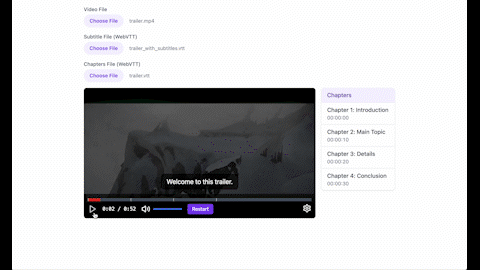

# @torutamahashi/video-player

A highly customizable React video player component with chapter markers, subtitles, and thumbnail preview functionality.

[Demo](https://stackblitz.com/edit/vitejs-vite-huml8hkv?file=src%2FApp.tsx)



## Features

- 📝 Chapter and subtitle support with WebVTT format
- 🖼 Thumbnail preview on seek bar hover
- 🎨 Fully customizable styling with TailwindCSS
- 🎯 Chapter markers on progress bar
- 🔊 Advanced volume control
- 🎨 Customizable icons
- 📱 Responsive design
- 🔧 TypeScript support

## Installation

```bash
npm install @torutamahashi/video-player
# or
yarn add @torutamahashi/video-player
# or
pnpm add @torutamahashi/video-player
```

### Add styling to your application
1. React without tailwindcss
   
Add the following code at the beginning of the global style file.
```typescript
// index.css 
@import '@torutamahashi/video-player/index.css';
```

1. React + tailwindcss
   
You need to install tailwindcss in advance
```typescript
// index.css
@import '@torutamahashi/video-player/index.css';
@tailwind base;
@tailwind components;
@tailwind utilities;
```

1. Remix with tailwind css

```typescript
// root.tsx
import videoPlayerStyles from '@torutamahashi/video-player/index.css?url';
import styles from './tailwind.css?url';
import type { LinksFunction } from '@remix-run/node';

export const links: LinksFunction = () => [
	{ rel: 'stylesheet', href: videoPlayerStyles },
	{ rel: 'stylesheet', href: styles },
];
```

Note: TailwindCSS is an optional peer dependency. You can use the default styles without it.

## Basic Usage

```tsx
import { VideoPlayer, Controls, useVideoPlayer } from '@torutamahashi/video-player';

function App() {
	const { videoRef, state, controls, videoPlayerProps } = useVideoPlayer()
	return (
		<VideoPlayer {...videoPlayerProps} src="path/to/video.mp4">
			<ControlsWrapper>
				<ProgressBar
					currentTime={state.currentTime}
					duration={state.duration}
					onSeek={controls.seek}
					height="sm"
					progressColor="#DC2626"
					videoRef={videoRef}
				/>
				<Controls
					videoRef={videoRef}
					isPlaying={state.isPlaying}
					currentTime={state.currentTime}
					duration={state.duration}
					volume={state.volume}
					onPlay={controls.play}
					onPause={controls.pause}
					onSeek={controls.seek}
					onVolumeChange={controls.setVolume}
				/>
			</ControlsWrapper>
		</VideoPlayer>
	);
}
```

## Using Chapters and Subtitles

The player supports WebVTT format for both chapters and subtitles.

### WebVTT Format Example

```vtt
WEBVTT

00:00:00.000 --> 00:02:30.000
1.0 Introduction

00:02:30.000 --> 00:05:00.000
2.0 Main Content
```

### Parsing WebVTT Files

Built-in parsers are available for both chapters and subtitles:

```typescript
import { parseVTT } from '@torutamahashi/video-player';

// Parse subtitles
const subtitles = parseVTT(vttContent);

// Parse chapters
const chapters = parseVTT(vttContent);
```

### Using Chapters in Component

see [Demo](https://stackblitz.com/edit/vitejs-vite-huml8hkv?file=src%2FApp.tsx)


### Icons

You can provide your own icons (default icons are included):

```tsx
const customIcons = {
	Play: ({ className }) => <YourPlayIcon className={className} />,
	Pause: ({ className }) => <YourPauseIcon className={className} />,
	VolumeHigh: ({ className }) => <YourVolumeHighIcon className={className} />,
	VolumeMedium: ({ className }) => <YourVolumeMediumIcon className={className} />,
	VolumeLow: ({ className }) => <YourVolumeLowIcon className={className} />,
	VolumeX: ({ className }) => <YourVolumeXIcon className={className} />,
};

<Controls {...props} customIcons={customIcons} />;
```

## TypeScript Support

The library includes comprehensive type definitions:

```typescript
import type {
	VideoPlayerRefType,
	VideoPlayerPropsType,
	ChapterType,
	SubtitleType,
	WebVTTType,
} from '@torutamahashi/video-player';

const chapters: Chapter[] = [
	{
		startTime: 0,
		endTime: 150,
		title: 'Introduction',
	},
];
```

for now WebVTTType = SubtitleType = ChapterType

## Contributing

Issues and Pull Requests are welcome! Please feel free to contribute to this project.

## Feedback

We'd love to hear your thoughts, suggestions, or any issues you encounter while using `@torutamahashi/video-player`. Your feedback helps us improve and make the library even better!

### How to Share Feedback

- **Bug Reports and Feature Requests**  
  Please open an [issue](https://github.com/torutamahashi/video-player/issues).  
  Use the provided templates for bug reports or feature requests to help us understand your feedback clearly.

- **Quick Feedback**  
  If you prefer, fill out this [short feedback form](https://docs.google.com/forms/d/e/1FAIpQLSe2U4hTRGFkOe4aBmHBjLbmtoU2yTWc5vTP-NsfVZCXyxBg5Q/viewform?usp=header).

## License

MIT © [Toru Tamahashi](https://github.com/torutamahashi)
